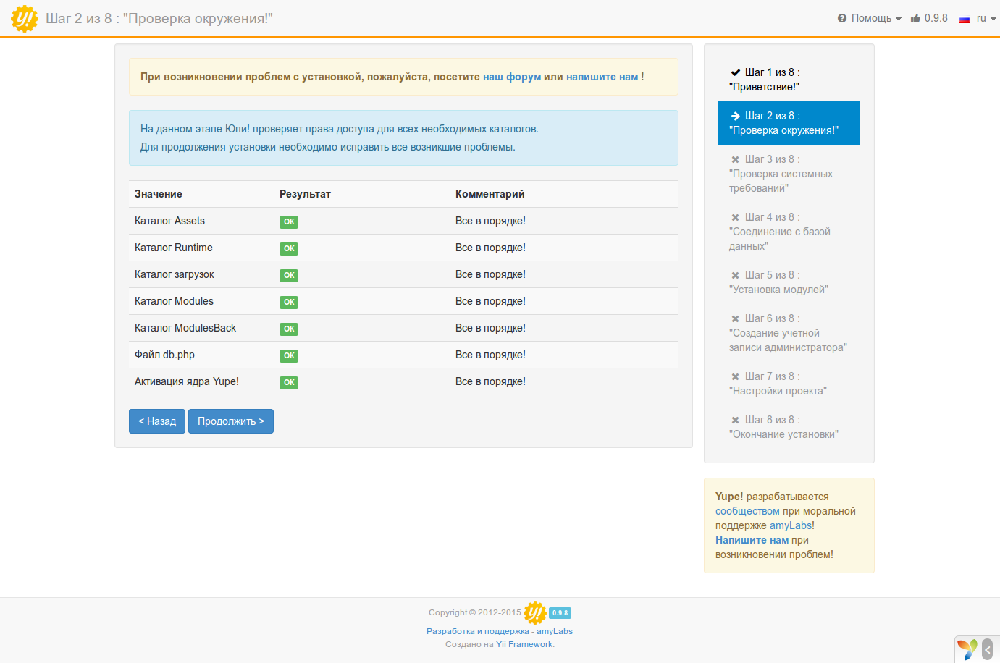
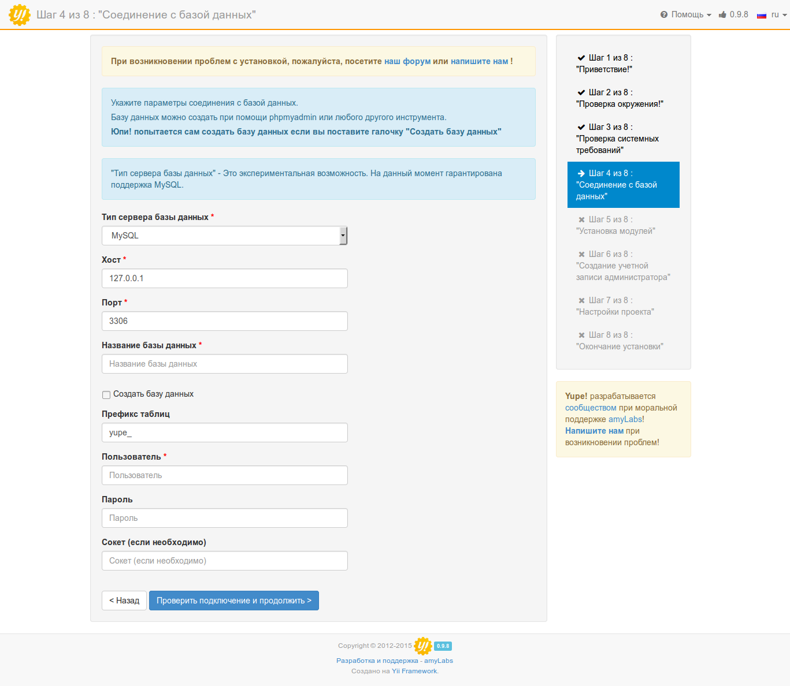
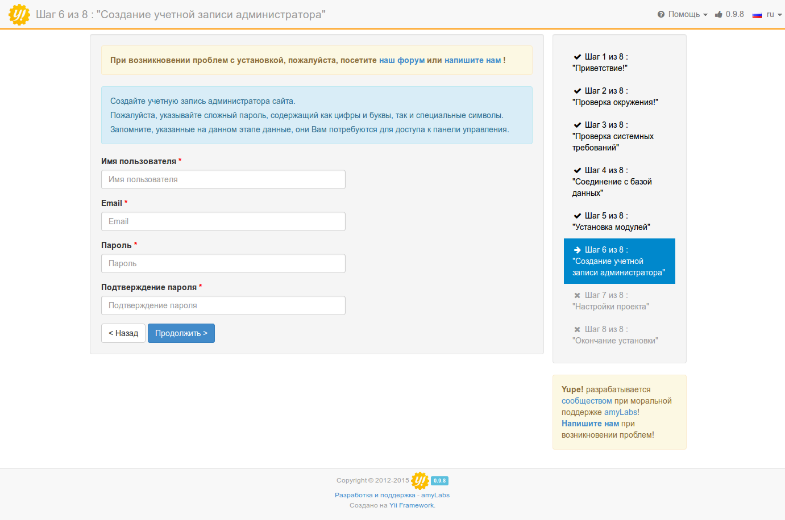
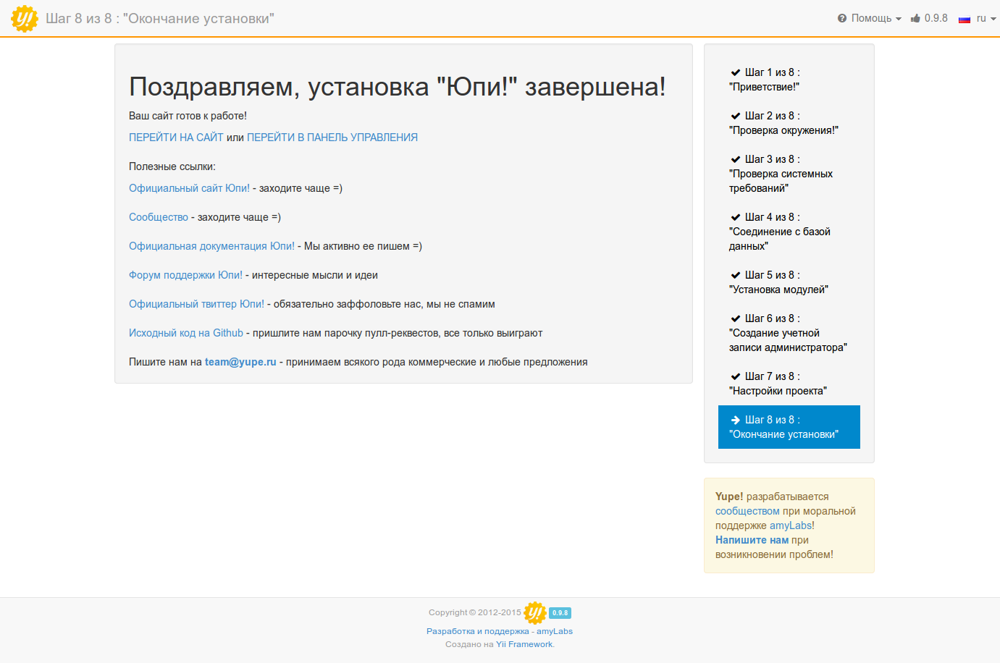

# Установка и запуск "Юпи!"

!!! note "Обратите внимание!"
    Перед установкой убедитесь, что ваш хостинг удовлетворяет [системным требованиям](/hosting/) платформы.

Юпи! нетребовательна к ресурсам, поэтому для проектов с невысокой и средней посещаемостью подойдет любой [виртуальный хостинг](http://yupe.ru/service/hosting), на котором будет установлены PHP (не ниже 5.4) и MySQL.
Обо всех остальных расширениях, необходимых для работы сайта, вы будете проинформированы на 3-м шаге установки системы.

Установку платформы можно разделить на следующие этапы:

* Получение дистрибтива
* Подготовка хостинга или сервера
* Установка платформы
* Настройка и запуск


Получение дистрибутива возможно тремя способами:

* Скачивание zip-архива (рекомендуем новичкам)
* Установка с помощью Composer (рекомендуем разработчикам)
* Клонирование репозитория с GitHub (рекомендуем разработчикам)

## Установка через Composer

> Для развертывания Юпи! вам понадобится [Composer](https://getcomposer.org/) и [Git](http://git-scm.com/downloads).
> В данной документации подразумевается глобальная установка Composer-а, если в вашем случае это не так, то вместо команды `composer` нужно писать `php composer.phar`

Установка последней стабильной версии производится командой:

```
composer create-project yupe/yupe <директория проекта> --no-dev --prefer-dist
```

Директорию проекта можно не указывать, в таком случае файлы Юпи! будут помещены в папку `yupe` в текущей директории.

Если вам нужно установить другую версию системы, например ту, которая на данный момент находится в разработке, то необходимо немного модифицировать уже известную нам команду:

```
composer create-project yupe/yupe:<номер версии>.x-dev <директория проекта> --no-dev --prefer-dist
```
Будьте осторожны при использовании версии из ветки *dev*, данная версия предназначена исключительно для разработчиков и может содержать нестабильный код.

Номер необходимой версии можно посмотреть на сайте [packagist.org](https://packagist.org/packages/yupe/yupe) или на [github](https://github.com/yupe/yupe/releases)

Composer самостоятельно скопирует файлы проекта и все зависимости, после чего проведет необходимые для установки подготовительные действия.
После успешного завершения процедуры вы можете переходить к установке системы.

Преимущества установки через composer:

* простота установки - запустите команду и остальное composer сделает за вас
* простота обновления зависимостей - composer самостоятельно может установить более свежие версии используемых пакетов
* простота интеграции дополительных пакетов - лубой composer-пакет может быть использован в вашем "Юпи!"-проекте без проблем

## Установка через Git

> Для развертывания этим способом вам понадобится [Composer](https://getcomposer.org/) и [Git](http://git-scm.com/downloads).
> В данной документации подразумевается глобальная установка Composer-а, если в вашем случае это не так, то вместо команды `composer` нужно писать `php composer.phar`

Клонируем проект:
```
git clone https://github.com/yupe/yupe.git <директория проекта>
```

Если не указывать целевую директорию, то файлы проекта будут размещены в папке `yupe`.
После завершения клонирования, переходим в директорию проекта и устанавливаем зависимости через Composer:
```
composer install
```

Преимущества установки через git:

* простота обновления до любой версии - простой командой вроде git pull вы сможете обновить "Юпи!" до самой последней версии.

Теперь можно переходить к установке Юпи!


## Установка из архива

Последнию версию Юпи! всегда можно скачать со [страницы загрузки](http://yupe.ru/download).

Преимущества установки из архива:

* вы получаете самую последнюю версию
* все необходимые файлы уже собраны и готовы к установке
* вам не потребуется ничего кроме ftp-доступа к хостингу

!!! note "Обратите внимание!"
    Если при подготовке к установке у вас возникли какие-то проблемы - посетите [специальную ветку нашего форума](http://talk.yupe.ru/viewforum.php?f=10) или [напишите нам](http://yupe.ru/contacts).

Последовательность действий:

* [скачиваем](http://yupe.ru/download) дистрибутив
* загружаем на [хостинг](http://yupe.ru/service/hosting)
* подготавливаем хостинг
* запускаем мастер установки

В загруженном архиве вы обнаружите следующую структуру директорий:

```
.
├── protected
├── public // именно на этот каталог должен смотреть корень вашего сайта
├── read.me
└── tests
├── themes
└── vendor
```

!!! danger "Важно!"
    Обратите внимание, что корень сайта должен быть настроен на каталог public. Именно в public находится index.php, требуемый для работы сайта.

Если в качестве хостинга вы выбрали [timeweb](http://timeweb.com/ru/services/hosting/?i=28284) - смотрите наше короткое видео:

<iframe width="560" height="315" src="https://www.youtube.com/embed/OSML7u0KXuE" frameborder="0" allowfullscreen></iframe>


## Мастер установки Юпи!

Чтобы проверить, что все сделано правильно, введите в браузере адрес своего сайта. Вы увидите экран приветствия инсталлятора Юпи!, на котором будет предложено выбрать язык установки.


**Шаг 2**: Проверка окружения



**Возможные проблемы**: неправильные права доступа к необходимым директориям.
Поменять права доступа можно командой в терминале `chmod 0777 <путь к директории>`, через ваш любимый FTP-менеджер (например FileZilla) или через файловый менеджер панели управления.

Расположение необходимых директорий в структуре проекта:

Значение | Путь
-------- | ------
Каталог Assets  | public/assets
Каталог Runtime | protected/runtime
Каталог загрузок | public/uploads
Каталог Modules | protected/config/modules
Каталог ModulesBack | protected/config/modulesBack
Файл db.php | protected/config

**Шаг 3**: Проверка системных требований


**Возможные проблемы**: не установлены необходимые расширения.

Виртуальные хостинги позволяют управлять расширениями PHP через панель управления.
Если такой возможности нет, то обратитесь к вашему системному администратору или в службу поддержки хостинга.
_Обратите внимание, что не все расширения обязательны._

**Шаг 4**: Соединение с базой данных

На этом этапе вы указываете данные для соединения с базой данных, которые вам предоставил хостер.



**Шаг 5**: Установка модулей

Этот шаг позволяет вам выбрать необходимые для установки модули.

После загрузки страницы отмечены рекомендованные модули, а также доступны три варианта: “Интернет-магазин”, “Только основные”, “Все”.

Вы можете выбрать нужные вам модули или изменить стандартные варианты, при этом будет автоматически изменяться состояние всех зависимых модулей.

Обратите внимание, что после установки системы, модулями можно будет управлять из административной панели. Если вы не уверены в том, какие модули вам могут понадобиться или забыли отметить нужный - ничего страшного, вы всегда можете к ним вернуться.


**Шаг 6**: Создание учетной записи администратора



**Шаг 7**: Настройки проекта


**Шаг 8**: Окончание установки

Надеемся, что все прошло хорошо и вас можно поздравить с успешной установкой Юпи!

Если что-то пошло не так - посетите [специальную ветку нашего форума](http://talk.yupe.ru/viewforum.php?f=10) или [напишите нам](http://yupe.ru/contacts)



!!! important "Придем на помощь!"
    Наши специалисты могут помочь вам <a href='http://yupe.ru/store/services/install.html' target='_blank'>установить</a> платформу на выбранный хостинг
    или произвести полную <a href='http://yupe.ru/store/services/server.html' target='_blank'>настройку сервера</a> - пожалуйста, обращайтесь!
