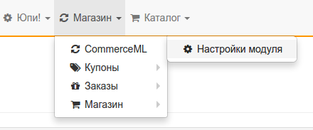
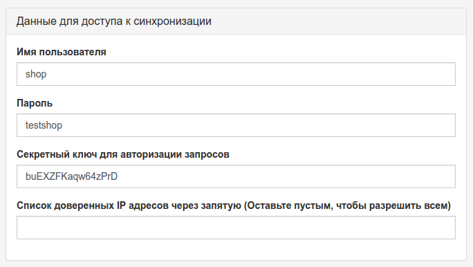
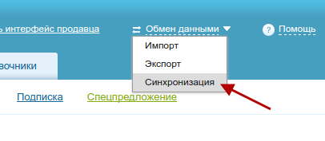
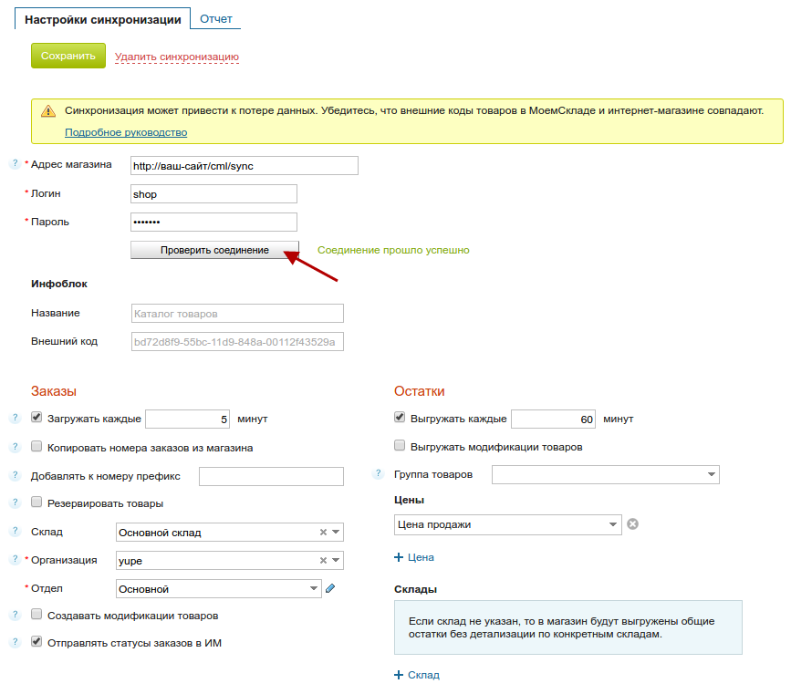
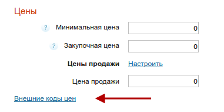
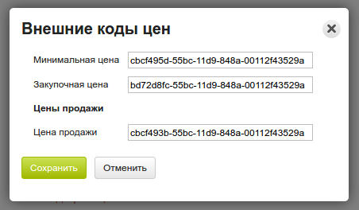

# МойСклад

[Модуль](https://yupe.ru/store/modules/crm/moy-sklad.html) создан для интеграции с сервисом "[МойСклад](https://www.moysklad.ru/)", но также позволяет обмениваться данными с программами 1С из-за того, что синхронизация осуществляется посредством стандарта [CommerceML](http://v8.1c.ru/edi/edi_stnd/90/92.htm).

При помощи этого модуля вы можете синхронизировать:

* категории товаров;
* товарные позиции (артикул, описание) с привязкой к категории;
* остатки на складе (количество и стоимость);
* заказы.

<h2>Установка</h2>

!!! important "Внимание!"
    При отсутствии должного технического опыта все перечисленные ниже процедуры лучше [доверить профессионалам](https://yupe.ru/service/support).
    
После [приобретения модуля](https://yupe.ru/store/modules/crm/moy-sklad.html) вам необходимо распаковать архив и поместить его содержимое в папку `protected/modules` сайта, который будет подключаться к сервису "МойСклад".

Затем в панели управления сайтом (Юпи! - Мои модули) устанавливаем его.


При условии успешной установки в меню раздела `Магазин` должен появиться пункт `CommerceML`



<h2>Настройка</h2>

Для начала в настройках модуля зададим данные для авторизации пользователя, который будет иметь доступ к синхронизации.



_Здесь указываются данные придуманного вами пользователя._

__Обратите внимание__, что нет никакой необходимости указывать данные администратора или любого другого пользователя зарегистрированного на сайте.

Также мы __настоятельно рекомендуем__ воздержаться от использования простого пароля и секретного ключа. Воспользуйтесь [специальными сервисами](https://lastpass.com/generatepassword.php) для их генерации.

__Секретный ключ__ указан для примера и его нужно __обязательно заменить__.

Оставшиеся поля пока не трогаем, сохраняем изменения и переходим к настройкам в сервисе "МойСклад". 

Для этого необходимо перейти в раздел `Синхронизация`, где нужно кликнуть на кнопку `Добавить магазин` и в выпадающем списке выбрать пункт `Обмен по CommerceML`.



!!! important "Владельцам продуктов 1С"
    Достаточно подробную инструкцию по настройке `1С Предприятие` вы можете найти [перейдя по ссылке](http://www.cs-cart.ru/docs/4.1.x/rus_build_pack/1c/instruction/index.html#id3). Следовать инструкции нужно до раздела "Настройки в интернет-магазине".

На открывшейся странице указываем адрес магазина, который формируется следующим образом: `http://ваш-сайт/cml/sync` (например `https://yupe.ru/cml/sync`), и указываем данные пользователя, придуманные ранее. 

После этого вы можете нажать на кнопку `Проверить соединение`, чтобы убедиться в правильности указанных данных. В этом случае появится сообщение "Соединение прошло успешно".



Далее в разделах `Заказы` и `Остатки` необходимо выбрать, который из них вы будете выгружать, и указать временные интервалы, через которые будет осуществляться выгрузка. 

При необходимости у заказов можно поставить отметку "Отправлять статусы заказов в ИМ", т.е. при изменении статуса заказа в МоемСкладе он будет выгружен на сайт.

!!! note "Обратите внимание"
    МойСклад не выгружает в CommerceML формате полные данные заказа. На сайт отправляются только статус заказа, в случае его изменения, и отметка об удалении.

Теперь можно перейти к оставшимся настройкам модуля CommerceML в панели управления интернет-магазином. Мы опишем лишь те, которые могут вызвать хоть какие-то вопросы:

<h5>Что делать с категориями, отсутствующими в файле импорта</h5> 
В каталоге вашего магазина уже могут быть категории, которых не будет в файле выгрузки. На этот случай системе нужно знать, что с ними делать. 

Доступны 3 варианта: Ничего, __Деактивировать__ и Удалить. 

По умолчанию выбран пункт Деактивировать - это значит, что категории будет присвоен статус `Черновик`. Она не будет отображаться на сайте, но вы сможете увидеть ее в панели управления.

<h5>Что делать с товарами, отсутствующими в файле импорта</h5> 
Все то же самое, как и у категорий, только у товара будет установлен статус `Недоступен`, если выбран пункт Деактивировать.

<h5>Статус "Нет в наличии" если количество = 0</h5>
Если в остатках на складе количество товара равно 0, то товару автоматически будет присвоен соответствующий статус. Данная опция будет работать только при включенной `Обновлять количество товара`.

<h5>"Ид" цены продукта, "Ид" скидочной цены продукта</h5>
Системе необходимо определять, которую из цен в файле выгрузки ставить в соответствующее поле товара.

!!! important "Внимание"
    Без указания внешнего кода цены на сайте обновляться не будут!

Чтобы узнать эти коды, вам нужно перейти в раздел `Справочники - Товары и услуги` в МоемСкладе, где кликнуть на кнопке создания нового товара или редактировании уже существующего.

На открывшейся странице, в блоке Цены, нажать на ссылку `Внешние коды цен`.





_Количество и названия цен могут отличаться от указанных на скриншоте_

__Не забудьте__ указать выбранные цены в настройках синхронизации сервиса МойСклад, чтобы они попали в файл выгрузки.

На этом все.

!!! note ""
    Сообщения о количестве выгруженных товаров, загруженных заказов или ошибках, будут доступны на вкладке `Отчет` в настроенной вами синхронизации в МоемСкладе. _См. скриншот выше_

# AmoCRM

<h2>Установка</h2>

Скопировать модуль в `protected/modules`.

Установить зависимости через composer.

```bash
$ composer require dotzero/yii-amocrm
```

<h2>Настройка</h2>
* Зайти в настройки AmoCRM и скопировать ключ API
* Перейти в "Сервисы" ---> AmoCrm и указать ключ, поддомен, email пользователя AmoCRM, нажать "Сохранить"
* Выбрать из списка поля email и телефон
* Поставить в крон команду  `php /<путь к сайту>/protected/yiic amocrm-export` 

# Социализация (social)

<h2>Настройка</h2>
В настоящее время отсутствует возможность подключения ключей социальных сетей посредством веб-интерфейса административной панели. Для обеспечения входа через социальные сети необходимо скопировать файл `./protected/config/social.php` в папку `/protected/userspace/social.php` и внести в него изменения.

<h3> Секция Google: </h3>
Необходимо указать 'сlient_id' и 'client_secret' - это идентификаторы OAuth2.0. Для их получения необходимо зайти в аккаунт Google, пройти по адресу `https://console.developers.google.com/`. Далее активировать Google Cloud API и создать на вкладке "Учетные данные" учетную запись OAuth2.0. Также необходимо указать адрес response_URI, по умолчанию это `http(https)://yourdomain.com/social/login/service/google`

<h3> Секция Facebook: </h3>
Необходимо указать 'сlient_id' и 'client_secret' - это идентификаторы OAuth2.0. Для их получения необходимо зайти в аккаунт Facebook и выбрать пункт "Управление приложением" либо воспользоваться прямой ссылкой `https://developers.facebook.com/apps/`. Далее необходимо создать новое приложение, выбрать тип приложения Web-сайт и заполнить форму настроек. <b>Обращаем внимание, что с 2018 г. вход через Facebook возможен только по протоколу HTTPS, в связи с этим на Вашем сайте должен быть установлен SSL-сертификат.</b>
