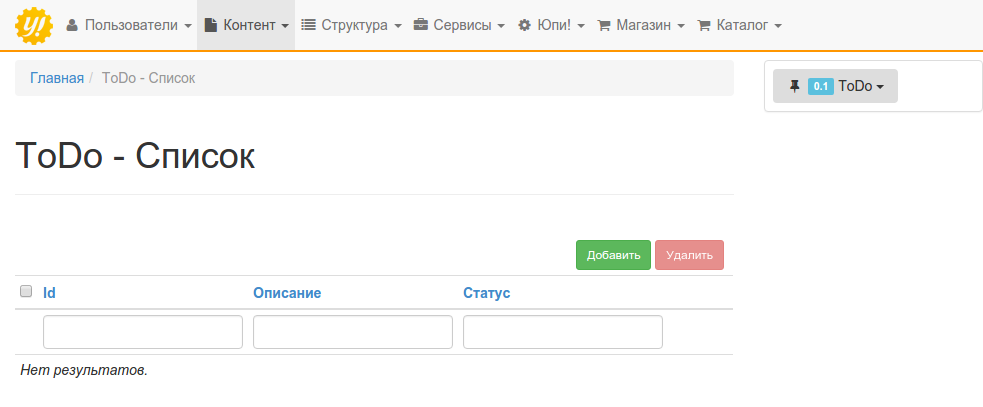
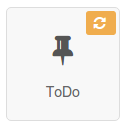
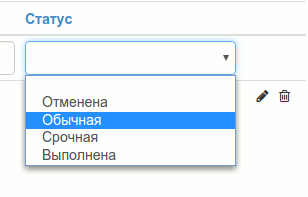
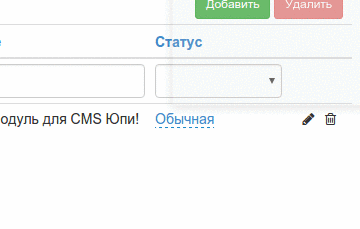
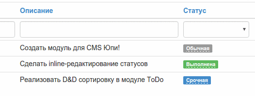
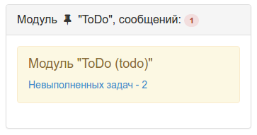

# Создание собственного модуля

## Введение
Команда Юпи! активно развивает систему и внедряет новые возможности, но надо признать, что мы не всесильны и не можем удовлетворить потребностей всех пользователей. В этой главе мы постараемся максимально подробно осветить вопрос создания собственных модулей для Юпи!, чтобы вы могли самостоятельно улучшить свой проект или может даже разместить модуль в нашем [Маркете](http://yupe.ru/marketplace).

!!! danger "Важно!"
    Если вы не знакомы с фреймворком [Yii](http://www.yiiframework.com/doc/guide/1.1/ru/quickstart.what-is-yii), то для более легкого понимания материала, рекомендую вам ознакомиться с шаблоном проектирования [MVC](http://www.yiiframework.com/doc/guide/1.1/ru/basics.mvc), [модулями](http://www.yiiframework.com/doc/guide/1.1/ru/basics.module) фреймворка, а еще лучше - изучить учебное пособие по [созданию блога](http://www.yiiframework.com/doc/blog/1.1/ru).

## Описание модуля
Поскольку нашей задачей является обучение, а не изобретение чего-то нового и интересного, то мы будем создавать простенький модуль задач "ToDo". Думаю, для наших целей этого будет достаточно.
Дабы не усложнять процесс, сделаем допущение, что в системе может быть зарегистрирован только один пользователь. Это позволит нам не разделять списки задач. В качестве домашнего задания вы можете реализовать эту возможность самостоятельно.

Все этапы разработки будут оформлены в отдельные коммиты, которые вы сможете посмотреть на [GitHub](https://github.com/sabian/yupe-todo).
Возникшие вопросы можно задать на нашем [форуме](https://talk.yupe.ru).

##### Список требований:
- должна быть возможность создавать, редактировать и удалять задачи;
- реализовать поиск по задачам и фильтрацию по статусу;
- inline-редактирование статусов задач;
- изменение приоритета задач перетаскиванием мышью (drag&drop);
- на главной странице панели управления отображать уведомления о количестве невыполненных задач.

Да, можно сделать всё гораздо проще, но нам бы хотелось охватить как можно больше различных аспектов создания модуля.

## Каркас модуля
Сначала нужно создать минимально возможную структуру модуля, для того, чтобы можно было включить его в панели управления и визуально наблюдать изменения в процессе его создания. 

!!! note "Обратите внимание!"
    Для большего понимания материала, мы не будем использовать генератор кода (Gii), а создадим каждый файл и директорию вручную. Конечно, в будущем вы можете использовать его для упрощения работы. Прочитать как это сделать, можно [здесь](http://www.yiiframework.com/doc/guide/1.1/ru/topics.gii).

Дальнейшие действия подразумевают, что у вас установлена последняя стабильная версия Юпи! и открыт любимый редактор кода с добавленными в проект файлами системы.

В `protected/modules` создаем директорию `todo` для нашего модуля. Все дальнейшие действия будут проводиться внутри этой категории. 

Создаем основной файл модуля `TodoModule.php` с одноименным классом, расширяющим компонент `WebModule` модуля `yupe`.

```php
use yupe\components\WebModule;

class TodoModule extends WebModule 
{
    
}
```

И добавляем в него методы:

**getDependencies** - возвращает массив модулей, от которых будет зависеть наш модуль. Допустим, если бы мы хотели добавить комментарии к нашим задачам и возможность добавления изображений, то нужно было бы написать так:
```php
return ['image', 'comment'];
```
Наш модуль вполне самостоятелен, поэтому мы вернем пустой массив.

**getVersion** - возвращает версию вашего модуля для отображения в панели управления.

**getCategory** - сообщает системе в какой вкладке меню, панели управления, отображать меню нашего модуля. Т.е., если мы хотим разместить его в меню "Контент", то так и напишем:
```php
return 'Контент';
```

**getName** - возвращает название модуля.

**getDescription** - краткое описание модуля.

**getAuthor** - имя автора или компании, создавшей модуль.

**getAuthorEmail** - email-адрес.

**getUrl** - ссылка на сайт автора или на демонстрационный сайт.

**getIcon** - иконка модуля. Указывается в формате `fa fa-fw <название>`. Выбрать подходящую иконку и узнать ее название можно на сайте [FontAwesome](https://fortawesome.github.io/Font-Awesome/icons/). В этом модуле используем иконку [thumb-tack](http://fortawesome.github.io/Font-Awesome/icon/thumb-tack/), значит метод должен вернуть строку `fa fa-fw fa-thumb-tack`.

**getAdminPageLink** - здесь указывается ссылка на какую-либо страницу (чаще главную) модуля. Она нужна для отображения кнопки модуля на главной странице панели управления. Строится она по следующему правилу: `/<название модуля>/<название контроллера>/<действие>`. Для модуля она примет такой вид: `/todo/todoBackend/index`.

**getNavigation** - сообщает системе о структуре меню модуля. Он крайне простой, поэтому сделаем только два пункта: просмотр списка задач и создание задачи.
```php
return [
    [
        'icon'  => 'fa fa-fw fa-list-alt',
        'label' => 'Список задач',
        'url'   => ['/todo/todoBackend/index']
    ],
    [
        'icon'  => 'fa fa-fw fa-plus-square',
        'label' => 'Создать задачу',
        'url'   => ['/todo/todoBackend/create']
    ],
];
```
Эти данные будут использованы для генерации главного меню панели управления.

Осталось создать еще один файл и мы сможем установить модуль, чтобы потом, добавляя функционал, можно было наблюдать за изменениями в панели управления.

Создаем директорию `install`, в которой размещаем файл с точно таким же названием, как и модуль - `todo.php`. В нем будет храниться конфигурация модуля, где, для начала, мы просто сообщим системе о его существовании:
```php
return [
    'module'    => [
        'class' => 'application.modules.todo.TodoModule',
    ],
];
```
Строчка `application.modules.todo.TodoModule` - это путь до главного класса модуля, где `application` указывает на директорию `protected`. 

Вот и все! Если все сделано правильно, то в разделе "Модули", во вкладке "Не установлен!", мы должны увидеть наш модуль.


После установки модуля вы должны увидеть пункт "ToDo" в главном меню и кнопку на главной странице панели управления.


И, хотя в нем еще ничего не отображается, кроме названия и меню модуля, а впереди нас ждет еще уйма работы, я думаю, можно вас поздравить с этим маленьким, но очень важным шагом.

Детально изучить созданные файлы вы можете в [этом коммите на GitHub](https://github.com/sabian/yupe-todo/commit/4ee5d8b316279d2c27c5a536b7fd4033be94db01). А если возникли вопросы, то смело задавайте их на нашем [форуме](https://talk.yupe.ru). Будем рады помочь!

## Миграции
Теперь пришло время задуматься над структурой таблицы модуля и создании миграции. О том, что такое миграции, для чего они нужны и как с ними работать, вы можете прочитать в [официальном руководстве](http://www.yiiframework.com/doc/guide/1.1/ru/database.migration).

В модулях Юпи! файлы миграций хранятся в директории `install/migrations`. Перед тем как продолжать, убедитесь, что вы ее создали.

Далее, в консоли, находясь в корневой папке вашего проекта, выполняем команду `php protected/yiic migrate create todo yupe_todo_table`. Этой командой мы создаем файл миграции `yupe_todo_table` для модуля `todo`. 

Если все прошло хорошо, то на данный момент у вас должна быть следующая структура директорий:

```
.
├── install
│   ├── migrations
│   │   └── m151205_141508_yupe_todo_table.php
│   └── todo.php
├── LICENSE
├── README.md
└── TodoModule.php
```

Теперь, в созданном файле, нужно описать поля таблицы для хранения задач. 
Согласно, описанным выше, требованиям к модулю, у задачи должно быть описание, статус и сортировка.

```php
class m151205_141508_yupe_todo_table extends yupe\components\DbMigration
{
    public function safeUp()
    {
        $this->createTable('{{todo}}', [
            'id' => 'pk',
            'description' => 'string NOT NULL',
            'status' => 'TINYINT(1) NOT NULL DEFAULT 1',
            'sort' => 'integer NOT NULL DEFAULT 1',
        ], $this->getOptions());
    }

    public function safeDown()
    {
        $this->dropTable('{{todo}}');
    }
}
```

Обратите внимание, что название таблицы заключено в двойные фигурные скобки `{{todo}}`. Это сделано для того, чтобы система автоматически подставила префикс для таблиц, который задается на этапе установки. Если вы ничего не меняли, то после применения миграции в базе данных должна появиться таблица `yupe_todo`.

Метод `getOptions` добавляет параметры таблицы: `ENGINE=InnoDB DEFAULT CHARSET=utf8`

Осталось только ввести команду `php protected/yiic migrate --module=todo` и подтвердить что хотите применить миграцию.

После успешного завершения операции, в базе данных должна появиться таблица со следующей структурой:

```
+-------------+--------------+------+-----+---------+----------------+
| Field       | Type         | Null | Key | Default | Extra          |
+-------------+--------------+------+-----+---------+----------------+
| id          | int(11)      | NO   | PRI | NULL    | auto_increment |
| description | varchar(255) | NO   |     | NULL    |                |
| status      | tinyint(1)   | NO   |     | 1       |                |
| sort        | int(11)      | NO   |     | 1       |                |
+-------------+--------------+------+-----+---------+----------------+
```

Результат на [GitHub](https://github.com/sabian/yupe-todo/commit/7feff834d603f30d86debccd151738145243455e)

## Модель
Учитывая, что официальное руководство по Yii фреймворку предоставляет исчерпывающую информацию о [моделях](http://www.yiiframework.com/doc/guide/1.1/ru/basics.model), их [создании](http://www.yiiframework.com/doc/guide/1.1/ru/form.model) и [работе с базой данных](http://www.yiiframework.com/doc/guide/1.1/ru/database.overview), лучше сразу перейти к делу.

В Юпи! есть базовый класс `YModel`, от которого должны быть унаследованы все модели. Исходя из этого, определяем класс:
```php
use yupe\models\YModel;

class Todo extends YModel
{
    
}
```

На этом этапе понадобится переопределить только три метода:
- **tableName** - возвращает название таблицы в базе данных. Здесь все просто, это будет строка `{{todo}}`;
- **rules** - правила валидации данных;
- **attributeLabels** - возвращает список меток аттрибутов в формате `'Атрибут' => 'Описание'`.

Все остальное будем дописывать при первой необходимости.

Посмотреть на получившийся код вы можете в соответствующем коммите на GitHub, ссылка на который указана в конце этого раздела.
А пока опишем требования для правил валидации:
- поле `description` должно быть обязательным и иметь длину не более 255 символов;
- поля `status` и `sort` должны быть целочисленными.

```php
['description', 'required'],
['description', 'length', 'max' => 255],
['status, sort', 'numerical', 'integerOnly' => true],
```

Пока это все, что мы можем написать в модели. В дальнейшем придется добавить несколько правил валидации и методов, а пока можно изучить [полученный результат](https://github.com/sabian/yupe-todo/commit/6330d8a7ec06a8dd86976b10514cce34df571ce0).

Если у вас возникли вопросы по предыдущим шагам руководства, то можете смело задавать их на [форуме](https://talk.yupe.ru). Возможно, это поможет нам дополнить руководство и сделать его более понятным.

На этом этапе, пожалуй, самым логичным будет создание административной части модуля. Начнем с контроллера.

В методе `getNavigation` (файл TodoModule.php) ссылки на пункты меню имеют следующий вид: `['/todo/todoBackend/index']`. Как уже говорилось ранее, они создаются по принципу `/название модуля/название контроллера/действие`. Из этого следует, что контроллер должен называться `TodoBackendController` и располагаться в директории `controllers`. 

К этому моменту структура директорий модуля должна иметь вид:

```
.
├── controllers
│   └── TodoBackendController.php
├── install
│   ├── migrations
│   │   └── m151205_141508_yupe_todo_table.php
│   └── todo.php
├── LICENSE
├── models
│   └── Todo.php
├── README.md
└── TodoModule.php
```

Обратите внимание, что контроллер должен наследовать `BackController`. Также создаем действие `index` в котором задаем отображение одноименного представления.

```php
use yupe\components\controllers\BackController;

class TodoBackendController extends BackController
{
    public function actionIndex()
    {
        $this->render('index');
    }
}
```

Файлы представлений должны находиться в директории `views`, внутри которой они сортируются по директориям, относящимся к конкретному контроллеру. В данном случае это `todoBackend`. Создаем файл и оставляем его пока пустым.

Для тех, кто не уверен, что правильно все понял: размещаем структуру категорий, которая должна быть после создания файла представления.

```
.
├── controllers
│   └── TodoBackendController.php
├── install
│   ├── migrations
│   │   └── m151205_141508_yupe_todo_table.php
│   └── todo.php
├── LICENSE
├── models
│   └── Todo.php
├── README.md
├── TodoModule.php
└── views
    └── todoBackend
        └── index.php
```

Если все сделано правильно, то при клике на пункте меню `Контент - ToDo` в панели управления не должно появляться ошибки, как это было ранее. Вы должны увидеть главное меню панели управления, блок с информацией о модуле и пустую контентную область.

## Отображение списка задач и фильтрация
Отвечать за отображение списка задач будет виджет [CustomGridView](https://github.com/yupe/yupe/blob/master/protected/modules/yupe/widgets/CustomGridView.php), которому нужен источник данных. Для этого будет использоваться [CActiveDataProvider](http://www.yiiframework.com/doc/api/1.1/CActiveDataProvider).

Теперь в модели (файл `models/Todo.php`) необходимо создать метод `search`, который и будет служить источником данных для отображения и фильтрации задач.

```php
public function search()
{
    $criteria = new CDbCriteria;

    $criteria->compare('description', $this->description, true);
    $criteria->compare('status', $this->status);

    return new CActiveDataProvider(get_class($this), [
        'criteria' => $criteria,
        'sort' => [
            'defaultOrder' => 'sort'
        ]
    ]);
}
```

Приведенный выше код не должен вызывать трудностей. Стоит только уделить немного внимания этим двум строкам:

```php
$criteria->compare('description', $this->description, true);
$criteria->compare('status', $this->status);
```

Здесь описываются условия для фильтрации данных, из которых можно понять, что поиск будет осуществляться только по двум полям: `description` и `status`. При этом для поля `description` третьим параметром передается `true`, что сообщает системе о возможности частичного совпадения фразы.

Для правильной работы поиска, в правилах валидации (метод `rules`) необходимо объявить эти поля безопасными для сценария `search`:

```php
['description, sort', 'safe', 'on' => 'search']
```

Теперь нужно изменить контроллер:

```php
public function actionIndex()
{
    // В модели включаем сценарий search
    $model = new Todo('search');

    // Получаем данные из запроса. 
    // Если в фильтре ничего не меняли, то в переменной будет null
    $query = Yii::app()->getRequest()->getQuery('Todo');

    $model->unsetAttributes();

    if ($query) {
        // Присваиваем атрибутам модели значения из запроса
        $model->setAttributes($query);
    }
    
    // Передаем модель в представление
    $this->render('index', ['model' => $model]);
}
```

А в представлении добавить виджет:

```php
$this->widget('yupe\widgets\CustomGridView', [
        'id' => 'todo-grid',
        'type' => 'condensed',
        'dataProvider' => $model->search(),
        'filter' => $model,
        'columns' => [
            'id',
            'description',
            'status',
            [
                'class' => 'yupe\widgets\CustomButtonColumn',
                'template' => '{update} {delete}'
            ],
        ],
    ]
);
```

Теперь в панели управления вы должны увидеть следующую картину:



Обращаем ваше внимание на то, что не весь код размещается в этом описании, а только самые важные его части. Более подробно изучить код этой части можно на [GitHub](https://github.com/sabian/yupe-todo/commit/f4d2019ff395c625857935a615bb2d2c1815926d).

## Добавление/изменение/удаление задач
Начнем работу с реализации возможности добавления данных.

Добавляем в `TodoBackendController` действие `actionCreate`:

```php
public function actionCreate()
{
    $model = new Todo();

    if ($data = Yii::app()->getRequest()->getPost('Todo')) {
        // Если форма была отправлена, то присваиваем атрибуты
        $model->setAttributes($data);

        if ($model->save()) {
            // Показываем пользователю сообщение, если данные успешно сохранены
            Yii::app()->user->setFlash(
                yupe\widgets\YFlashMessages::SUCCESS_MESSAGE,
                'Задача успешно добавлена'
            );

            $this->redirect(
                (array)Yii::app()->getRequest()->getPost(
                    'submit-type',
                    ['create']
                )
            );
        }
    }

    $this->render('create', ['model' => $model]);
}
```

Теперь нужно создать файл представления, под названием `create`, в котором будет отображаться форма для ввода данных. 

Поскольку форма будет использоваться как при создании задачи, так и при ее редактировании, то, для избежания дублирования кода, будет логично вынести ее в отдельный файл.

```php
$this->renderPartial('_form', ['model' => $model]);
```

Для удобства навигации по разделам модуля добавим меню в правый сайдбар:
```php
$this->menu = [
    ['icon' => 'fa fa-fw fa-list-alt', 'label' => 'Список задач', 'url' => ['/todo/todoBackend/index']],
    ['icon' => 'fa fa-fw fa-plus-square', 'label' => 'Создать задачу', 'url' => ['/todo/todoBackend/create']],
];
```

Отображение формы будет осуществляться виджетом [ActiveForm](https://github.com/yupe/yupe/blob/master/protected/modules/yupe/widgets/ActiveForm.php). Валидация данных будет проводиться на клиентской стороне:
```php
'enableClientValidation' => true,
```

Работа со статусами будет добавлена позднее, поэтому сейчас форма содержит только поле "Описание" 
```php
<?= $form->textFieldGroup($model, 'description'); ?>
```

После добавления нужных файлов у вас должна быть следующая структура директории `view`

```
└── views
    └── todoBackend
        ├── create.php
        ├── _form.php
        └── index.php
```

Весь добавленный код вы можете увидеть в [этом коммите](https://github.com/sabian/yupe-todo/commit/189ca50a797a782f087f6cc704453d9135787916).

Если вы нигде не ошиблись, то можете попробовать добавить первую задачу. После её сохранения она появится в списке задач.

Изменение задачи по сути ничем не отличается от ее создания, за исключением того, что нужно получить изменяемые данные. 
Создадим метод `loadModel`, который будет выбирать нужную строку из базы данных по первичному ключу, а в случае её отсутствия сообщать об ошибке.

```php
private function loadModel($id)
{
    $model = Todo::model()->findByPk($id);

    if ($model === null) {
        throw new CHttpException(404, 'Запрошенная страница не найдена.');
    }

    return $model;
}
```

```php
public function actionUpdate($id)
{
    // загружаем данные
    $model = $this->loadModel($id);

    if ($data = Yii::app()->getRequest()->getPost('Todo')) {

        $model->setAttributes($data);

        if ($model->update()) {
            Yii::app()->user->setFlash(
                YFlashMessages::SUCCESS_MESSAGE, 
                'Задача успешно обновлена'
            );

            $submitType = Yii::app()->getRequest()->getPost('submit-type');

            if (isset($submitType)) {
                // Если пользователь нажал "Сохранить и закрыть", 
                // то отправляем его на главную страницу модуля
                $this->redirect([$submitType]);
            } else {
                // Иначе остаемся на странице редактирования задачи
                $this->redirect(['update', 'id' => $model->id]);
            }
        }
    }

    $this->render('update', ['model' => $model]);
}
```

Далее создаем файл представления `update`, который будет отличаться от `create` только названиями заголовков и "хлебными крошками". Попробуйте самостоятельно сделать этот файл. Подсмотреть решение можно [здесь](https://github.com/sabian/yupe-todo/commit/2157ef21c754c40b562aa64bef59a4b96c93587b).

Для завершения этой части работ осталось только реализовать обработку удаления задачи.

Следует отметить, что групповое удаление записей [реализовано](https://github.com/yupe/yupe/blob/master/protected/modules/yupe/components/controllers/BackController.php#L123) в контроллере `BackController`, свойства и методы которого наследует контроллер модуля `TodoBackendController`, так что дополнительной реализации не требуется.

В первую очередь создаем фильтр, который будет запрещать обращение к методу `actionDelete` напрямую и разрешать его только через POST запрос:

```php
public function filters()
{
    return CMap::mergeArray(
        parent::filters(),
        [
            'postOnly + delete',
        ]
    );
}
```

_Обратите внимание на объединение двух массивов: родительского и фильтров текущего контроллера. Про это не стоит забывать, т.к. в родительском классе определяется фильтр, ограничивающий доступ к административной части вашего модуля._

Далее реализуем удаление:
```php
public function actionDelete($id)
{
    if ($this->loadModel($id)->delete()) {
        Yii::app()->user->setFlash(
            YFlashMessages::SUCCESS_MESSAGE, 
            'Задача успешно удалена'
        );

        if (!Yii::app()->getRequest()->getParam('ajax')) {
            $this->redirect(
                (array)Yii::app()->getRequest()->getPost('returnUrl', 'index')
            );
        }
    }
}
```

Здесь все очень просто и не требует дополнительных пояснений.

Работа над основными действиями закончена. Теперь вы можете добавлять, изменять и удалять задачи. Результат, как всегда, можно посмотреть в соответствующем [коммите на GitHub](https://github.com/sabian/yupe-todo/commit/2157ef21c754c40b562aa64bef59a4b96c93587b), а если возникли вопросы, то можно задать их на [форуме Юпи!](https://talk.yupe.ru).

## Статусы
Наверняка вы уже попробовали добавить задачу и увидели: в списке вместо статуса отображается цифра 1, что крайне неинформативно. Также нет возможности редактировать статус. Пора это исправить.

В корневой директории модуля создаем директорию `helpers`, в которой будет находиться файл `TodoStatusHelper`, содержащий названия статусов и методы для работы с ними.

Чтобы каждый раз не думать о том, какому статусу соответствует та или иная цифра, присвоим их соответствующим константам. Это также упростит редактирование значения статуса при необходимости.

```php
class TodoStatusHelper
{
    const STATUS_CANCELLED = 0;
    const STATUS_DEFAULT = 1;
    const STATUS_URGENT = 2;
    const STATUS_DONE = 3;
}
```

Предлагаем ограничиться четырьмя статусами: Отменена, Обычная, Срочная, Выполнена. При необходимости вы можете самостоятельно расширить этот список.

Также понадобятся методы для получения списка статусов и получения названия статуса по его номеру.

```php
public static function getList()
{
    return [
        self::STATUS_CANCELLED => 'Отменена',
        self::STATUS_DEFAULT => 'Обычная',
        self::STATUS_URGENT => 'Срочная',
        self::STATUS_DONE => 'Выполнена',
    ];
}

public static function getLabel($id)
{
    $list = self::getList();

    return $list[$id];
}
```

Чтобы класс хелпера был доступен для дальнейшего использования, необходимо добавить в конфигурационный файл модуля (`install/todo.php`) следующие строки:

```php
'import' => [
    'application.modules.todo.helpers.*',
],
```

После чего нужно обновить конфигурацию модуля. Это можно сделать в панели управления, кликнув на специальный значок, который появится на кнопке модуля:



или выполнив консольную команду: `php protected/yiic yupe updateConfig`

Подготовительные работы закончены, теперь пора отобразить название статусов в списке задач. Для этого в файле `views/todoBackend/index.php` значение `status` массива `columns` заменяем на нижеследующий код:

```php
[
    'name' => 'status',
    'value' => function (Todo $data) {
        return TodoStatusHelper::getLabel($data->status);
    }
],
```

Теперь вместо непонятной цифры у вас должно отображаться название статуса


Для удобства фильтрации задач по статусу сделаем выпадающий список

```php
'filter' => CHtml::activeDropDownList($model, 'status', TodoStatusHelper::getList(), [
    'encode' => false, 
    'empty' => '', 
    'class' => 'form-control',
]),
```



Согласитесь, стало гораздо удобней!

Далее реализуем возможность смены статуса задачи через форму редактирования. Для этого изменим файл `views/todoBackend/_form.php`, где вместо кода

```php
<div class="row">
    <div class="col-sm-12">
        <?= $form->textFieldGroup($model, 'description'); ?>
    </div>
</div>
```

поставим следующий

```php
<div class="row">
    <div class="col-sm-8">
        <?= $form->textFieldGroup($model, 'description'); ?>
    </div>
    <div class="col-sm-4">
        <?= $form->dropDownListGroup($model, 'status', [
            'widgetOptions' => [
                'data' => TodoStatusHelper::getList(),
            ],
        ]); ?>
    </div>
</div>
```

Теперь, зайдя в редактирование или добавление задачи, рядом с текстовым полем вы увидите выпадающий список с названиями статусов.

Наберитесь терпения, остались последние штрихи и со статусами будет покончено. Нам осталось сделать inline-редактирование статуса, т.е. дать возможность пользователю поменять статус задачи прямо из списка, не заходя в форму редактирования.

В Юпи! это сделать не просто, а очень просто! Реализуем в классе `TodoBackendController` метод `actions`

```php
public function actions()
{
    return [
        'inline' => [
            'class' => 'yupe\components\actions\YInLineEditAction',
            'model' => 'Todo',
            'validAttributes' => [
                'status',
            ]
        ],
    ];
}
```

Здесь вы сообщаете системе, что в этом классе будет еще одно действие (`inline`), доступное по адресу `/todo/todoBackend/inline`. Такой подход позволяет избежать ненужного дублирования кода и упростить его изменение. 

Значение ключа `class` указывает на класс, ответственный за обработку данного действия. Т.е. вам не нужно каждый раз создавать метод `actionInline` и копировать в него один и тот же код. Представьте насколько усложнилась бы ваша жизнь, если вам пришлось вносить небольшое изменение в работу этого метода, а их у вас было бы 100. В данном случае вам нужно отредактировать только один файл.

Значение ключа `model` содержит название модели, которая будет отвечать за обработку данных, а в `validAttributes` хранятся названия полей,
 доступных для редактирования.

Осталось заменить код колонки `status` в файле `views/todoBackend/index.php` на следующий:

```php
[
    'name' => 'status',
    'class' => 'yupe\widgets\EditableStatusColumn',
    'url' => $this->createUrl('/todo/todoBackend/inline'),
    'source' => TodoStatusHelper::getList(),
    'filter' => CHtml::activeDropDownList($model, 'status', TodoStatusHelper::getList(), [
        'encode' => false,
        'empty' => '',
        'class' => 'form-control',
    ]),
],
```

А теперь можно насладиться результатом:



Напоследок предлагаем сделать цветовое кодирование статусов, чтобы их было проще различать. Для этого в класс хелпера добавляем новый метод:

```php
public static function getStylesList()
{
    return [
        self::STATUS_CANCELLED => ['class' => 'label-danger'],
        self::STATUS_DEFAULT => ['class' => 'label-default'],
        self::STATUS_URGENT => ['class' => 'label-primary'],
        self::STATUS_DONE => ['class' => 'label-success'],
    ];
}
```

В нем каждому статусу присваивается свое [название класса](http://getbootstrap.com/components/#labels) метки. И добавляем строку `'options' => TodoStatusHelper::getStylesList(),` в описание колонки `status` в файле `views/todoBackend/index.php` 


Код этой части модуля доступен по [ссылке](https://github.com/sabian/yupe-todo/commit/3f4478ab1e79f704ec59f9316573a0fb8eed1745). Если у вас возникли вопросы, можете смело задавать их на нашем [форуме](https://talk.yupe.ru).

## Сортировка перетаскиванием (drag&drop)
В модуле нет необходимости делать сортировку, т.к. приоритеты задач определяются статусами. Но, поскольку он создается в учебных целях, то предлагаем реализовать эту возможность.

В метод `actions` файла `TodoBackendController` добавляем определение действия `sortable`:

```php
'sortable' => [
    'class' => 'yupe\components\actions\SortAction',
    'model' => 'Todo',
    'attribute' => 'sort'
]
```

Поле `sort`, в котором будет храниться порядок сортировки записей, мы уже создали в разделе Миграции. Обратите внимание, что для корректной работы сортировки значение по умолчанию должно быть 1 (`NOT NULL DEFAULT 1`).

В класс модели `Todo` добавляем метод `beforeSave`, который задает порядок сортировки для новых записей:

```php
protected function beforeSave()
{
    if ($this->isNewRecord) {
        $this->sort = Yii::app()->db->createCommand()
            ->select('MAX(sort) + 1')
            ->from($this->tableName())
            ->queryScalar();
    }

    return parent::beforeSave();
}
```

Следующие строки добавляем к параметрам виджета `CustomGridView` в файле `views/todoBackend/index.php`:

```php
'sortableRows' => true,
'sortableAjaxSave' => true,
'sortableAttribute' => 'sort',
'sortableAction' => '/todo/todoBackend/sortable',
```

Это всё! [Вот так просто](https://github.com/sabian/yupe-todo/commit/ee46a97aaaee031bf8d27ffc76a2fd8214ddfcc1), вы можете реализовать drag&drop сортировку записей в вашем модуле для CMS Юпи!



## Уведомление о невыполненных задачах в панели управления
Согласно списку требований, в административной части модуля осталось реализовать уведомление о невыполненных задачах.

Реализацию начнем с создания метода `checkUnfinished` в классе `Todo`:

```php
public function countUnfinished()
{
    return self::model()->count(
        'status != :status', 
        [':status' => TodoStatusHelper::STATUS_DONE]
    );
}
```

Здесь все очень просто: метод возвращает количество записей в базе, у которых статус не равен "Выполнено".

А в класс `TodoModule` добавляем следующий код:

```php
public function checkSelf()
{
    $messages = [];
    $count = Todo::model()->countUnfinished();

    if(!$count) {
        return false;
    }

    $messages[WebModule::CHECK_NOTICE][] = [
        'type' => WebModule::CHECK_NOTICE,
        'message' => CHtml::link('Невыполненных задач - ' . $count, ['/todo/todoBackend/index']),
    ];

    return $messages;
}
```

Метод `checkSelf` будет вызываться всякий раз, когда вы будете заходить в панель управления. Уведомления будут показываться на главной странице в одноименном блоке.

В этом методе мы обращаемся к ранее созданному `countUnfinished`. Если значение переменной `$count` больше ноля, то метод возвращает массив, содержащий сообщение со ссылкой на главную страницу модуля. Впоследствии массивы сообщений всех модулей сливаются в один и выводятся на экран.



[Код раздела на GitHub](https://github.com/sabian/yupe-todo/commit/39d5032b30ddf6229c506a2787983ff25cf501ae)

На этом работу над модулем можно считать завершенной. Изложенного выше материала должно хватить для понимания базовых принципов создания модулей для CMS Юпи! 
Поскольку административная часть модуля отличается от клиентской лишь названием контроллеров, то, в качестве практики, мы предлагаем вам самостоятельно реализовать отдельную страницу для отображения открытых задач на вашем тестовом сайте. При желании вы можете пойти дальше и расширить функциональность модуля или начать писать свой собственный.

В директории `protected/modules` содержится множество готовых модулей, в которых вы можете посмотреть примеры реализаций необходимого вам функционала.

С возникшими вопросами ждем вас [на форуме Юпи! CMS](http://talk.yupe.ru/)
