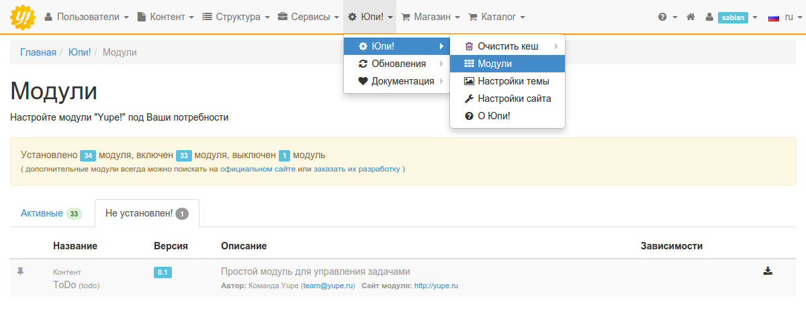

# Создание собственного модуля

## Введение
Команда Юпи! старается активно развивать систему и внедрять новые возможности, но надо признать, что мы не всесильны и не можем удовлетворить потребностей всех пользователей. В этой главе мы постараемся максимально подробно осветить вопрос создания собственных модулей для Юпи!, чтобы вы могли самостоятельно улучшить свой проект или может даже разместить модуль в нашем [Маркете](http://yupe.ru/marketplace).

Если вы не знакомы с фреймворком [Yii](http://yiiframework.ru/doc/guide/ru/quickstart.what-is-yii), то для более легкого понимания материала, рекомендую вам ознакомиться с шаблоном проектирования [MVC](http://yiiframework.ru/doc/guide/ru/basics.mvc), [модулями](http://yiiframework.ru/doc/guide/ru/basics.module) фреймворка, а еще лучше - изучить учебное пособие по [созданию блога](http://yiiframework.ru/doc/blog/ru/start.overview).

## Описание модуля
Поскольку нашей задачей является обучение, а не изобретение чего-то нового и интересного, то мы будем создавать простенький модуль задач "ToDo". Думаю для наших целей этого будет достаточно.
Дабы не усложнять процесс, сделаем допущение, что в системе может быть зарегистрирован только один пользователь. Это позволит нам не разделять списки задач. В качестве домашнего задания вы можете реализовать эту возможность самостоятельно.

Все этапы разработки будут оформлены в отдельные коммиты, которые вы сможете посмотреть на [GitHub](https://github.com/sabian/yupe-todo).
Возникшие вопросы можно задать на нашем [форуме](http://yupe.ru/talk/).

##### Список требований:
**backend**
- должна быть возможность создавать, редактировать и удалять задачи;
- реализовать поиск по задачам и фильтрацию по статусу;
- inline-редактирование статусов задач;
- изменение приоритета задач перетаскиванием мышью (drag&drop);
- на главной странице панели управления отображать уведомления о количестве невыполненных задач.

**frontend**
- создать страницу со списком задач и предоставить возможность пометить задачу как выполненную;
- сделать виджет, отображающий активные задачи, и разместить кнопку для перехода на страницу редактирования.

Да, можно сделать всё гораздо проще, но нам бы хотелось охватить как можно больше различных аспектов создания модуля.

## Каркас модуля
Сначала нам нужно создать минимально возможную структуру модуля, для того, чтобы можно было включить его в панели управления и визуально наблюдать изменения в процессе его создания. 
>Для большего понимания материала, мы не будем использовать генератор кода (Gii), а создадим каждый файл и директорию вручную. Конечно в будущем вы можете использовать его для упрощения работы. Прочитать как это сделать, вы можете [здесь](http://yupe.ru/docs/module.create.html).

Дальнейшие действия подразумевают, что у вас установлена последняя стабильная версия Юпи! и открыт любимый редактор кода с добавленными в проект файлами системы.

В `protected/modules` создаем директорию `todo` для нашего модуля. Все дальнейшие действия будут проводиться внутри этой категории. 

Создаем основной файл модуля `TodoModule.php` с одноименным классом, расширяющим компонент `WebModule` модуля `yupe`.

```php
use yupe\components\WebModule;

class TodoModule extends WebModule 
{
    
}
```

И добавляем в него методы:

**getDependencies** - возвращает массив модулей от которых будет зависеть наш модуль. Допустим, если бы мы хотели добавить комментарии к нашим задачам и возможность добавления изображений, то нужно было бы написать так:
```php
return ['image', 'comment'];
```
Наш модуль вполне самостоятелен, поэтому мы вернем пустой массив.

**getVersion** - возвращает версию вашего модуля для отображения в панели управления.

**getCategory** - сообщает системе в какой вкладке меню, панели управления, отображать меню нашего модуля. Т.е. если мы хотим разместить его в меню "Контент", то так и напишем:
```php
return 'Контент';
```

**getName** - возвращает название вашего модуля

**getDescription** - краткое описание модуля

**getAuthor** - имя автора или компании создавшей модуль

**getAuthorEmail** - email адрес

**getUrl** - ссылка на сайт автора или на демонстрационный сайт

**getIcon** - иконка модуля. Указывается в формате `fa fa-fw <название>`. Выбрать подходящую иконку и узнать ее название можно на сайте [FontAwesome](https://fortawesome.github.io/Font-Awesome/icons/). В нашем модуле мы будем использовать иконку [thumb-tack](http://fortawesome.github.io/Font-Awesome/icon/thumb-tack/), значит метод должен вернуть строку `fa fa-fw fa-thumb-tack`

**getAdminPageLink** - здесь указывается ссылка на какую-либо страницу (чаще главную) нашего модуля. Она нужна для отображения кнопки нашего модуля на главной странице панели управления. Строится она по следующему правилу: `/<название модуля>/<название контроллера>/<действие>`. Для нашего модуля она примет такой вид: `/todo/todoBackend/index`.

**getNavigation** - сообщает системе о структуре меню модуля. Он у нас крайне простой, поэтому сделаем только два пункта: просмотр списка задач и создание задачи.
```php
return [
    [
        'icon'  => 'fa fa-fw fa-list-alt',
        'label' => 'Список задач',
        'url'   => ['/todo/todoBackend/index']
    ],
    [
        'icon'  => 'fa fa-fw fa-plus-square',
        'label' => 'Создать задачу',
        'url'   => ['/todo/todoBackend/create']
    ],
];
```
Эти данные будут использованы для генерации главного меню панели управления.

Осталось создать еще один файл и мы сможем установить модуль, чтобы потом, добавляя функционал, мы могли наблюдать за изменениями в панели управления.

Создаем директорию `install` в которой размещаем файл с точно таким же названием, как и наш модуль - `todo.php`. В нем будет храниться конфигурация модуля, где для начала, мы просто сообщим системе о его существовании:
```php
return [
    'module'    => [
        'class' => 'application.modules.todo.TodoModule',
    ],
];
```
Строчка `application.modules.todo.TodoModule` - это путь до главного класса модуля, где `application` указывает на директорию `protected`. 

Вот и все! Если все сделано правильно, то в разделе "Модули", во вкладке "Не установлен!", мы должны увидеть наш модуль.


После установки модуля вы должны увидеть пункт "ToDo" в главном меню и кнопку на главной странице панели управления.


И хотя у нас еще ничего не отображается, кроме названия и меню модуля, а впереди нас ждет еще уйма работы, я думаю, можно вас поздравить с этим маленьким, но очень важным шагом.

Детально изучить созданные файлы вы можете в [этом коммите на GitHub](https://github.com/sabian/yupe-todo/commit/4ee5d8b316279d2c27c5a536b7fd4033be94db01). А если возникли вопросы, то смело задавайте их на нашем [форуме](http://yupe.ru/talk/). Будем рады помочь!


-----------
**План работы** (это для себя и не войдет в доки):
- создание каркаса модуля (только основные файлы, чтобы можно было включить в админке и увидеть меню). Для наглядности сделать какие-нибудь параметры, чтобы можно было редактировать через настройки.
- Продумывание структуры БД, создание миграций и их применение.
- создание модели и переводов
- CRUD
- инлайн редактирование статусов
- D&D сортировка
- поиск и фильтрация
- уведомления о невыполненных задачах на главной
- Контроллер на фронте с гридом задач (здесь можно написать еще про хлебные крошки и сео-теги)
- реализация действия кнопки "Выполнено"
- создание виджета и размещение его в сайдбаре.